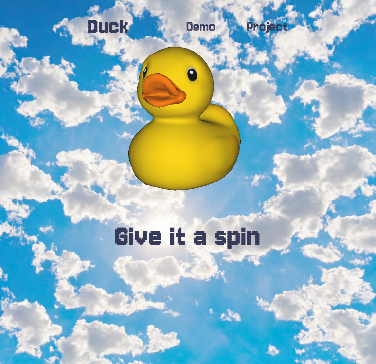

# Three.js Demo

A cute open source 3D duck model spinning on a background generated by AI.

- 3D models GitHub repository [glTF-Sample-Assets](https://github.com/KhronosGroup/glTF-Sample-Assets)
- AI generative tool running locally in browser from the repository [stable-diffusion-webui](https://github.com/AUTOMATIC1111/stable-diffusion-webui)

<p align="center">

</p>

## Install and run

```bash
npm install
npm run dev
```
